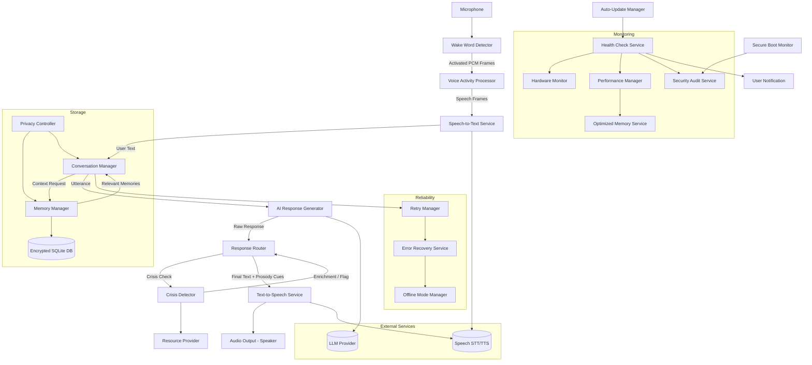

# AI Wellness Companion Design Document

## Overview

The AI Wellness Companion is a voice-activated therapeutic assistant designed to run on a Raspberry Pi, providing emotional support and companionship for individuals living alone and elderly users. The system combines conversational AI with natural voice interaction to create an empathetic, always-available companion that maintains appropriate boundaries around medical advice.

The design prioritizes simplicity, reliability, and privacy while delivering a natural conversational experience that can develop meaningful relationships over time.

## Architecture

### System Architecture



### Design Rationale

**Raspberry Pi Platform**: Affordable, reliable, supports local inference (wake word, VAD) while maintaining connectivity for cloud AI.

**Hybrid Processing Model**: Latency‑sensitive & privacy‑critical steps (wake word, initial buffering, crisis heuristic pre-filter) run locally; high‑value generative reasoning can use pluggable remote or local models.

**Modular Architecture**: Aligns with repository structure (`audio/`, `conversation/`, `memory/`, `crisis/`, `health/`, `security/`, etc.) enabling isolated testing and substitution.

**Graceful Degradation**: Offline mode supplies cached / templated fallback responses when network or provider thresholds fail.

## Components and Interfaces (Implementation Mapping)

| Module Directory | Key Classes / Services | Primary Responsibilities |
|------------------|------------------------|---------------------------|
| `src/audio` | WakeWordDetector, SpeechToTextService, TextToSpeechService, VoiceActivityProcessor | Audio acquisition, activation, streaming ASR, synthesis |
| `src/conversation` | ConversationManager, OptimizedPipeline, AIService, ResponseRouter | Dialogue state, context assembly, model invocation, routing & enrichment |
| `src/memory` | MemoryManager, StorageService, PrivacyController | Persistence (encrypted), selective recall, privacy policy enforcement |
| `src/crisis` | CrisisDetector, ResourceProvider | Risk signal extraction, resource recommendation |
| `src/health` | HealthCheckService, ComponentMonitors, AutoUpdateManager | Liveness, readiness, system updates |
| `src/security` | PrivacySettingsManager, TLSManager, SecurityAuditService, AudioCleanupService | Transport security, audit scaffolding, transient data lifecycle |
| `src/error` | RetryManager, ErrorRecoveryService, OfflineModeManager, HardwareMonitor | Fault isolation, retries, degraded operation, hardware anomalies |
| `src/performance` | PerformanceManager, OptimizedMemoryService | Latency metrics, adaptive pruning, optimization knobs |
| `src/logging` | Logger | Structured logging (PII‑scrubbed) |

## AI Response Generation

Supported model backends (pluggable via configuration):
- OpenAI (e.g., GPT‑4o Mini) – cost efficient + strong instruction following
- Anthropic (Claude Haiku) – safety leaning alternative
- Google Gemini Flash – generous free tier for prototyping
- Local (Ollama: Llama / Phi / Mistral families) – zero network / maximum privacy

Selection Logic (pseudo):
1. If `config.ai.preferredProvider` healthy & within budget window -> use
2. Else fallback chain ordered by `config.ai.fallbackPriority[]`
3. If all remote unavailable -> local model (if installed) -> offline template set

## Data Models (TypeScript)

```ts
// Conversation / Messaging
export interface Message {
  id: string;
  timestamp: Date;
  speaker: 'USER' | 'COMPANION';
  content: string;
  emotionalTone?: string;
  confidenceScore: number; // 0..1 from STT or model classification
}

export interface ConversationSession {
  sessionId: string;
  userId: string;
  startTime: Date;
  endTime?: Date;
  history: Message[];
  emotionalContext: EmotionalState;
  privacyLevel: PrivacyLevel;
}

export type MemoryType = 'PERSONAL' | 'PREFERENCE' | 'CONVERSATION';

export interface Memory {
  id: string;
  content: string;
  importanceScore: number; // 0..1 for retention heuristics
  createdAt: Date;
  lastReferenced: Date;
  type: MemoryType;
}

export interface UserProfile {
  userId: string;
  preferences: Record<string, unknown>;
  conversationMemories: Memory[];
  crisisContacts: Contact[];
  privacySettings: PrivacySettings;
  lastInteraction: Date;
}

// Supporting domain interfaces (simplified)
export interface EmotionalState { label: string; confidence: number; }
export interface PrivacySettings { level: PrivacyLevel; allowMemoryStorage: boolean; }
export type PrivacyLevel = 'LOW' | 'STANDARD' | 'HIGH';
export interface Contact { name: string; phone?: string; region?: string; }
```

## Configuration Strategy

Central config file (`config.json`) with environment overrides:
- `audio`: device indices, sample rates, VAD aggressiveness
- `ai`: preferredProvider, fallbackPriority, maxTokens, temperature, safetyFilters
- `memory`: dbPath, encryptionKeyRef, retentionPolicy (importance threshold, maxHistory)
- `crisis`: keywordSets, sentimentThresholds, coolDownMinutes
- `performance`: latencyTargets, pruningBatchSize, metricsFlushIntervalMs
- `security`: tlsMinVersion, keyRotationDays, transientFileTTLSeconds

Secrets & keys supplied via environment variables or secure file (`cloudkey.json`) excluded from logs.

## Processing Sequence (Typical Utterance)

1. Audio stream captured continuously
2. Wake word match (Porcupine / custom) -> activates pipeline
3. Voice Activity Processor segments speech
4. Segments sent to STT (streaming) -> partial + final text
5. ConversationManager builds context (recent messages + retrieved memories)
6. CrisisDetector pre-screens user text for high‑risk keywords (fast heuristic)
7. AIService sends prompt to selected model backend
8. Response returned, optionally enriched (tone tags)
9. CrisisDetector re-evaluates assistant draft for compliance adjustments
10. ResponseRouter formats final text + prosody cues
11. TTS renders audio; AudioCleanupService schedules temp file deletion
12. MemoryManager stores salient memories (importance algorithm)
13. Performance & health metrics recorded

## Error Handling (Refined)

| Category | Detection | Mitigation | User Feedback |
|----------|-----------|------------|---------------|
| Wake Word Misses | Sliding accuracy window | Sensitivity auto-tune | “I may have missed you; try again.” |
| STT Failure | Timeout / empty transcript | Retry w/ backoff -> fallback offline phrases | “Could you please repeat that?” |
| Model Timeout | Latency > threshold | Cancel & fallback chain | “Thinking took too long; trying another method.” |
| TTS Error | Non-200 / synthesis gap | Switch voice / provider | Subtle retry chime + verbal notice |
| Network Loss | HealthCheck connectivity probe | Offline mode templates | “I have limited abilities offline right now.” |
| DB Locked / Corrupt | SQLite error codes | Re-open / restore from last good snapshot | “Some memories are temporarily unavailable.” |
| Crisis Escalation | High risk score | Immediate resource injection | Provide hotline calmly |

Retries use exponential backoff (jittered) capped, feeding metrics to PerformanceManager.

## Memory Retention Heuristic

`retain = (importanceScore * w1) + (recencyDecay * w2) + (referenceFrequency * w3)`
- Decay: `recencyDecay = exp(-Δt / tau)`
- Prune when DB size > soft limit OR latency budgets threatened.

## Security and Privacy Enhancements

- Encrypted at rest via AES-256 GCM (libsodium / node:crypto) with key derived from hardware-bound secret.
- Ephemeral audio buffers zeroed after transcription.
- Structured logs exclude raw user content; only hashed identifiers + redacted categories.
- Periodic security audit task validates TLS ciphers, dependency CVEs.
- PrivacyController enforces user opt-out: memory write operations become no-ops if disallowed.

## Compliance & Ethical Boundaries

- Clear disclaimers: Not a medical professional; encourages professional help for clinical indications.
- Crisis flows prioritize directing user to emergency services; no diagnostic claims.
- Data portability: Export function composes decrypted, user-readable JSON with user approval.

## Performance Targets

| Metric | Target | Strategy |
|--------|--------|----------|
| Wake Word Latency | < 250 ms | Native audio frames, low-overhead model |
| STT Partial Text | < 1.0 s | Streaming API + incremental VAD |
| First Token (LLM) | < 2.5 s typical | Context window optimization, trimmed system prompt |
| Full Response (<=100 tokens) | < 5.0 s | Adaptive token limits, provider fallback |
| TTS Synthesis | < 1.2 s | Cache recent voices + prosody patterns |
| Startup Time | < 30 s | Lazy init of non-critical modules |

## Testing Strategy (Augmented)

Additional to existing tests:
- Deterministic prompt unit tests (snapshot template hashing)
- Memory pruning property tests (retention ordering) 
- Security regression tests (ensure redaction & encryption paths)
- Load tests with synthetic audio to validate concurrency limits

## Observability

- Metrics: Prometheus exposition (optional) or JSON lines -> processed by analyzer tool.
- Tracing: Lightweight span IDs linking STT -> LLM -> TTS segments.
- Alert thresholds: wake word false negative spike, model timeout rate, crisis detection volume anomaly.

## Open Issues / Future Work

- Adaptive personalization with on-device fine-tuning (federated patterns) – deferred pending privacy review.
- Local small model distillation for offline empathy mode.
- Multi-user voice profile differentiation.
- Edge noise suppression model integration.

## Summary

This revision aligns the document with the current TypeScript codebase, introduces explicit interface definitions, clarifies fallback logic, strengthens privacy & security posture, and provides actionable performance, observability, and testing guidance to reduce ambiguity for implementation and future maintenance.